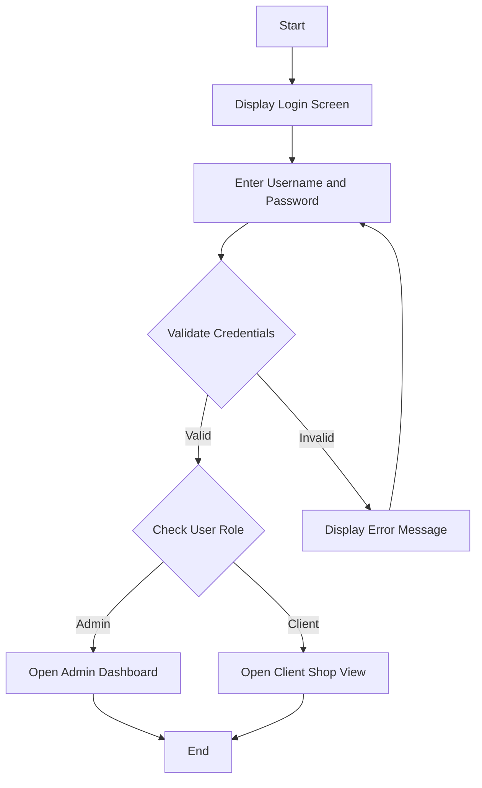
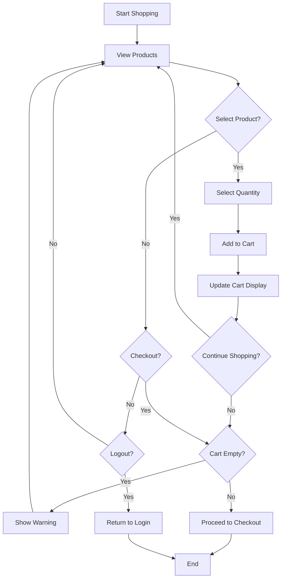
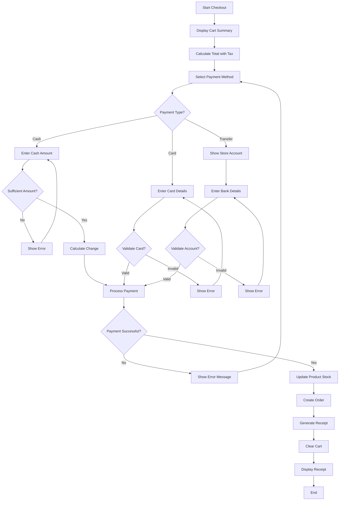
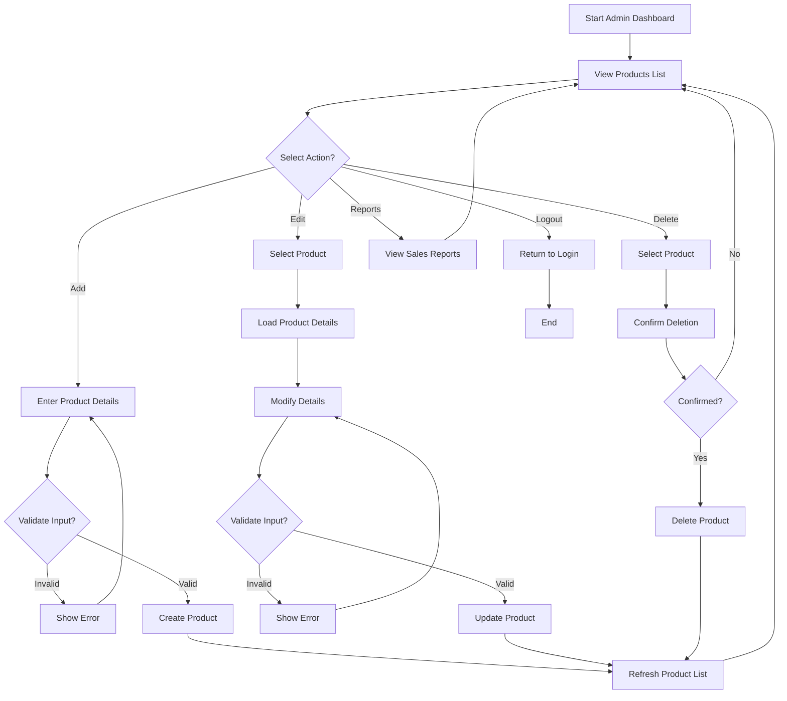
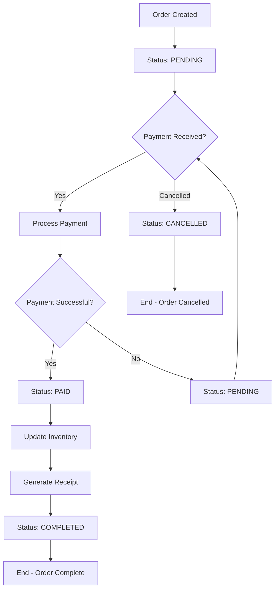

# Activity Diagram

This document describes the main activity flows in the Point of Sale (POS) System.

## 1. Login Activity Flow

## 2. Shopping Activity Flow (Client)

## 3. Checkout and Payment Activity Flow

## 4. Product Management Activity Flow (Admin)

## 5. Order Processing Flow

## Activity Descriptions

### Login Flow
1. User enters credentials
2. System validates against stored users
3. Role-based redirection to appropriate view

### Shopping Flow
1. Client browses products
2. Adds items to cart
3. Reviews cart contents
4. Proceeds to checkout

### Payment Flow
1. Select payment method
2. Enter payment details
3. Validate and process payment
4. Generate receipt

### Admin Flow
1. View and manage products
2. CRUD operations on inventory
3. View reports
