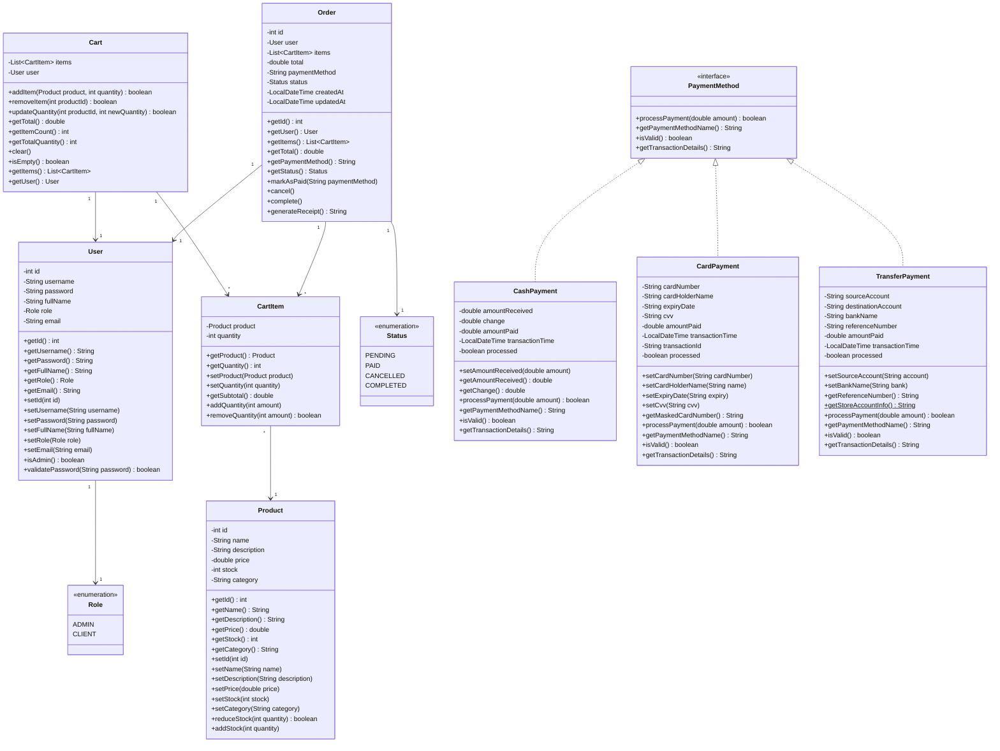

# Class Diagram

This document describes the class structure for the Point of Sale (POS) System.

## Diagram (Mermaid)

## Class Descriptions

### Models Package

#### User
Represents a system user with authentication and role information.
- Supports two roles: ADMIN and CLIENT
- Provides password validation

#### Product
Represents a product in the inventory.
- Includes stock management methods
- Categorized for filtering

#### CartItem
Represents a product in the shopping cart with quantity.
- Calculates subtotal automatically

#### Cart
Shopping cart for a user session.
- Manages cart items
- Calculates total

#### Order
Represents a completed order.
- Tracks order status
- Generates receipt

### Payments Package

#### PaymentMethod (Interface)
Contract for all payment implementations.
- Strategy pattern for payment processing

#### CashPayment
Handles cash transactions.
- Calculates change

#### CardPayment
Handles credit/debit card payments.
- Validates card information
- Masks card number for security

#### TransferPayment
Handles bank transfer payments.
- Generates reference numbers
