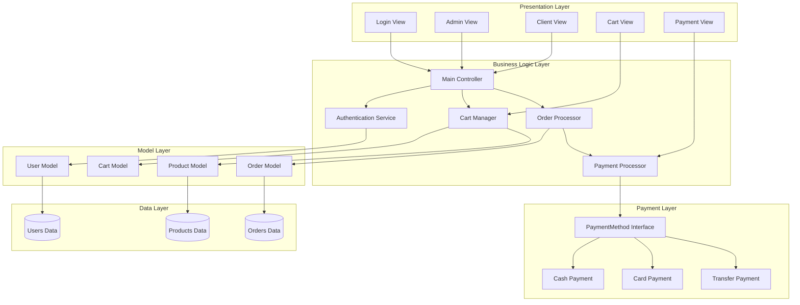
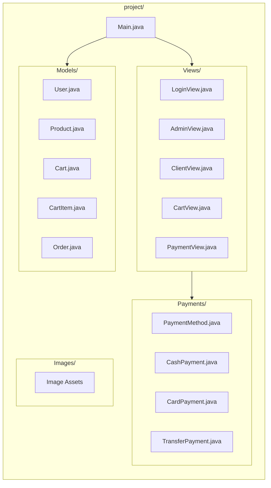
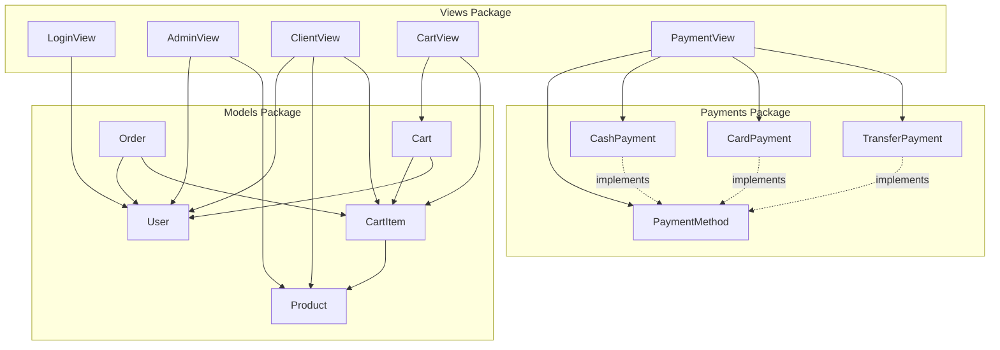

# Component Diagram

This document describes the component architecture of the Point of Sale (POS) System.

## System Component Diagram

## Package Structure Diagram

## Component Dependencies

## Component Descriptions

### Presentation Layer
| Component | Description |
|-----------|-------------|
| LoginView | User authentication interface |
| AdminView | Administrator dashboard with product management |
| ClientView | Shopping interface for customers |
| CartView | Shopping cart management dialog |
| PaymentView | Payment processing dialog |

### Business Logic Layer
| Component | Description |
|-----------|-------------|
| Main | Application entry point and controller |
| AuthService | User authentication logic |
| CartManager | Shopping cart operations |
| OrderProcessor | Order creation and management |
| PaymentProcessor | Payment method handling |

### Model Layer
| Component | Description |
|-----------|-------------|
| User | User data model with roles |
| Product | Product inventory model |
| Cart | Shopping cart model |
| CartItem | Individual cart item |
| Order | Order transaction model |

### Payment Layer
| Component | Description |
|-----------|-------------|
| PaymentMethod | Interface for payment strategies |
| CashPayment | Cash transaction handling |
| CardPayment | Card transaction handling |
| TransferPayment | Bank transfer handling |

## Design Patterns Used

1. **MVC (Model-View-Controller)**
   - Models: Data representation
   - Views: User interface
   - Controller: Main.java handles logic

2. **Strategy Pattern**
   - PaymentMethod interface
   - Multiple payment implementations

3. **Observer Pattern (implicit)**
   - Swing event listeners
   - UI updates on data changes

## Technology Stack

- **Language**: Java 8+
- **UI Framework**: Java Swing
- **Architecture**: MVC Pattern
- **Design Patterns**: Strategy, Observer
