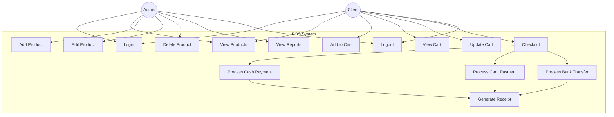

# Use Case Diagram

This document describes the use cases for the Point of Sale (POS) System.

## Diagram (Mermaid)

## Use Case Descriptions

### UC1: Login
- **Actor**: Admin, Client
- **Description**: Users authenticate with username and password to access the system
- **Precondition**: User has valid credentials
- **Postcondition**: User is logged in and redirected to appropriate dashboard

### UC2: View Products
- **Actor**: Admin, Client
- **Description**: View list of available products with details (name, price, stock, category)
- **Precondition**: User is logged in
- **Postcondition**: Products are displayed in a table

### UC3: Add Product
- **Actor**: Admin
- **Description**: Add new product to the inventory
- **Precondition**: Admin is logged in
- **Postcondition**: New product is added to the system

### UC4: Edit Product
- **Actor**: Admin
- **Description**: Modify existing product details
- **Precondition**: Admin is logged in, product exists
- **Postcondition**: Product details are updated

### UC5: Delete Product
- **Actor**: Admin
- **Description**: Remove product from inventory
- **Precondition**: Admin is logged in, product exists
- **Postcondition**: Product is removed from the system

### UC6: Add to Cart
- **Actor**: Client
- **Description**: Add selected product with quantity to shopping cart
- **Precondition**: Client is logged in, product is in stock
- **Postcondition**: Product is added to cart

### UC7: View Cart
- **Actor**: Client
- **Description**: View all items in the shopping cart with subtotals
- **Precondition**: Client is logged in
- **Postcondition**: Cart contents are displayed

### UC8: Update Cart
- **Actor**: Client
- **Description**: Modify quantity or remove items from cart
- **Precondition**: Client is logged in, cart is not empty
- **Postcondition**: Cart is updated

### UC9: Checkout
- **Actor**: Client
- **Description**: Proceed to payment for cart items
- **Precondition**: Client is logged in, cart is not empty
- **Postcondition**: Payment view is displayed

### UC10-12: Process Payment
- **Actor**: Client
- **Description**: Complete payment using selected method (Cash/Card/Transfer)
- **Precondition**: Client is in checkout
- **Postcondition**: Payment is processed

### UC13: Generate Receipt
- **Actor**: System
- **Description**: Generate and display order receipt
- **Precondition**: Payment is successful
- **Postcondition**: Receipt is displayed to user

### UC14: View Reports
- **Actor**: Admin
- **Description**: View sales reports and analytics
- **Precondition**: Admin is logged in
- **Postcondition**: Reports are displayed

### UC15: Logout
- **Actor**: Admin, Client
- **Description**: End the current session
- **Precondition**: User is logged in
- **Postcondition**: User is logged out and redirected to login
