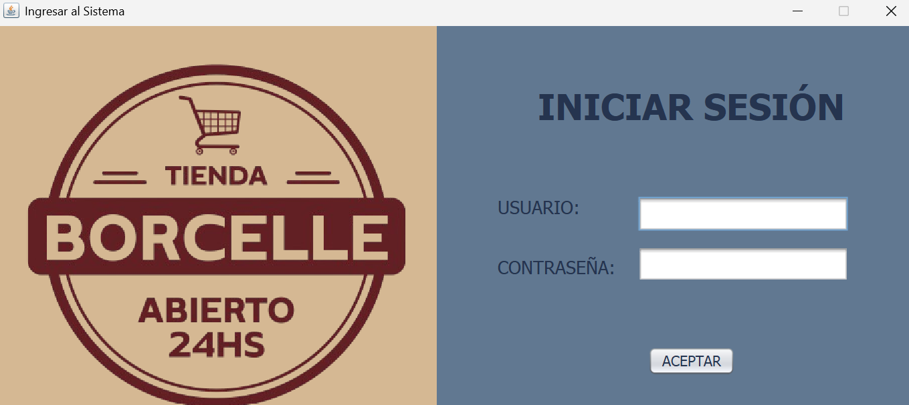
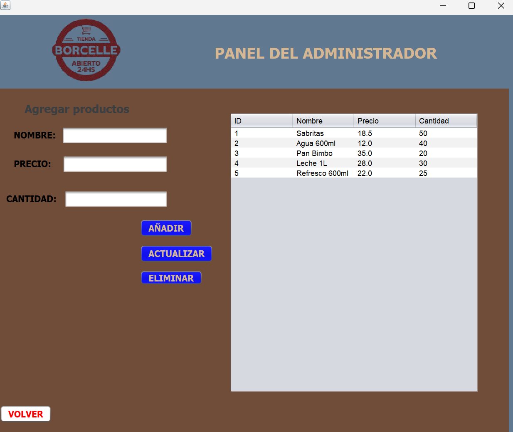
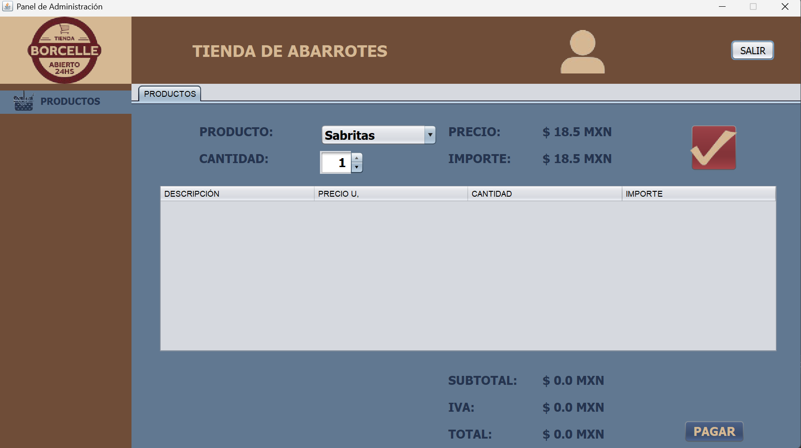
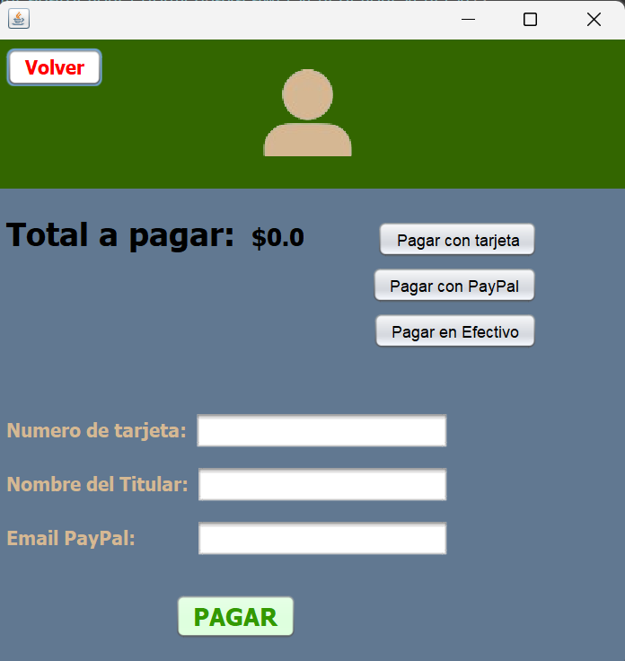

<p align="center">
  
</p>

<div align="center">

# 🛒 Sistema de Ventas – Java Swing  
### _Proyecto de Ingeniería en Computación_

Aplicación de escritorio desarrollada en **NEATBEANS** para la gestión de ventas, productos e inventario con módulo de pagos.

</div>

---

## 🚀 Descripción del Proyecto
Este sistema permite realizar ventas desde una interfaz gráfica profesional, donde el usuario puede:
- Seleccionar productos
- Elegir cantidades
- Visualizar subtotal, IVA y total
- Procesar pagos con distintos métodos

El proyecto está orientado a simular el funcionamiento real de un **punto de venta (POS)**.

---

## 🧩 Características Principales
✅ Interfaz gráfica con Java Swing  
✅ Carrito de compras dinámico  
✅ Cálculo automático de subtotal, IVA y total  
✅ Métodos de pago:
- Tarjeta
- PayPal
- Efectivo  
✅ Panel de cliente y panel administrativo  
✅ Arquitectura por paquetes (MVC)  
✅ Proyecto listo para ampliarse

---

## 🖥️ Vistas del Sistema (Ejecución Real)

<p align="center">
  
  
</p>

<p align="center">
  
  
</p>

---

## 🔄 Flujo del Sistema
```text
Login → Panel Administrativo → Panel de Cliente → Carrito → Pago → Confirmación

## 📁 Estructura del Proyecto

```plaintext
.
├── README.md
├── assets/
│   ├── logjn.png
│   ├── admin_panel.png
│   ├── panel_client.png
│   ├── pay_panel.png
│   └── flujo_tienda_borcelle.gif
│
├── documentacion/
│   ├── casos_uso.png
│   ├── diagrama_clases.png
│   ├── diagrama_actividades.png
│   └── diagrama_componentes.png
│
└── proyecto/
    └── (Código fuente en Java)
├── src/
│   ├── Main/
│   │   └── Main.java
│   ├── Models/
│   │   ├── Inventory.java
│   │   └── Product.java
│   ├── Payments/
│   │   ├── Pago.java
│   │   ├── PagoEfectivo.java
│   │   ├── PagoTarjeta.java
│   │   └── PagoPayPal.java
│   └── Views/
│       ├── LoginView.java
│       ├── AdminView.java
│       ├── ClientView.java
│       └── PayView.java

```


   <br>

   ## 🛠️ Tecnologías Utilizadas

- ☕ Java SE
- 🪟 Java Swing (Interfaz Gráfica)
- 🗄️ Programación Orientada a Objetos (POO)
- 📊 JTable para manejo de productos
- 🎨 Diseño personalizado con assets PNG

-----------------------------------------------------
## Requisitos de ejecucion

Java JDK 17 o superior

IDE recomendado: IntelliJ IDEA o NetBeans
Sistema Operativo: Windows, linux o MacOs

---------------------------------------------------------------
## Como ejecutar el archivo
1. Clona el repositorio
2. Abre el proyecto en tu IDE
3. Compila el proyecto
4. Ejecuta la clase principal (Main)

## Estado del Proyecto

✅ Funcional
🛠️ En mejora continua
📚 En fase de documentación final

## Autor

-Leonel Figueroa Jauregui
-Maria Jose Camarena Lomeli
-Gustavo Sanchez de Tagle Carmona
Ingeniería en Computación – CUAltos, Universidad de Guadalajara

## Licencia
MIT License
Copyright (c) 2025
Permiso concedido para uso, copia, modificación y distribución del software.

<div align="center">

⭐ Si este proyecto te fue útil, apóyame con una estrella en GitHub ⭐

</div> <p align="center">  </p> ```

